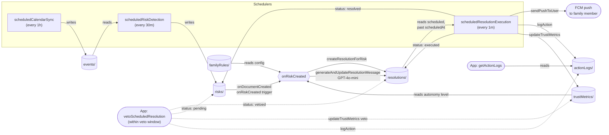
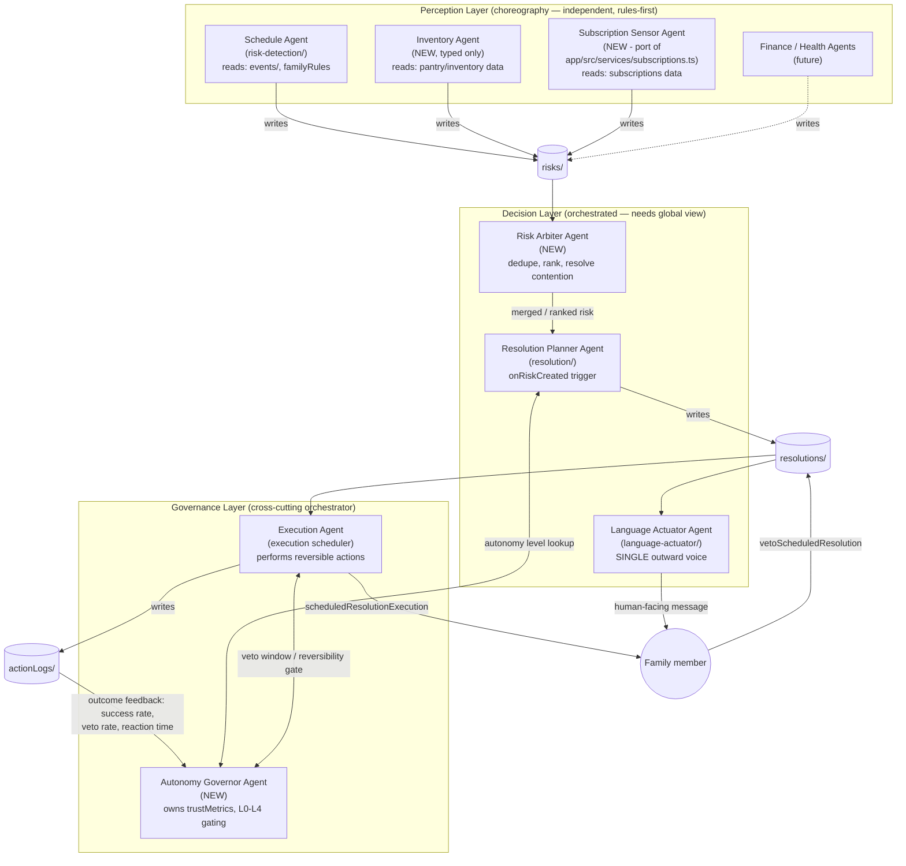
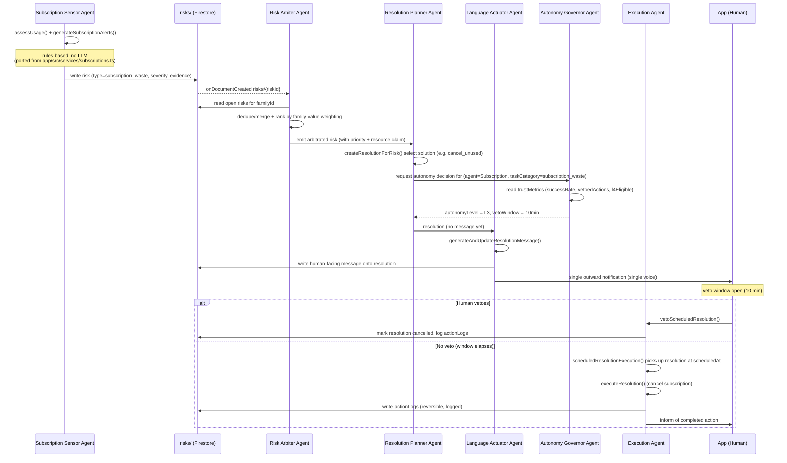

# Laxie Multi-Agent Architecture

Laxie is committed to a single success metric — the user first says "It found out before I did, and it already handled it for me" — and the backend already behaves like an implicit multi-agent pipeline in service of that metric: independent schedulers detect risk, a Firestore trigger plans a resolution, a single module speaks to the user, and a scheduler executes the reversible action. This document names that pipeline explicitly, extends it into a three-layer model (Perception, Decision, Governance) that lets each domain (schedule, inventory, subscriptions, and future finance/health) climb the L0–L4 Autonomy Ladder independently, and lays out an incremental, shippable-and-reversible migration path — starting with moving the client-side subscription engine (`app/src/services/subscriptions.ts`) into the backend as the first standalone Domain Sensor Agent.

> **Related documents:** [`ADR-0001-agent-framework-selection.md`](./ADR-0001-agent-framework-selection.md) records why this multi-agent architecture is built as plain TypeScript Cloud Functions rather than adopting an agent framework. [`PRODUCT_CONSTITUTION.md`](./PRODUCT_CONSTITUTION.md) and [`PRODUCT_Autonomy_Ladder.md`](./PRODUCT_Autonomy_Ladder.md) define the principles and the L0–L4 trust model this design serves.

## Table of Contents

1. [Purpose & Context](#1-purpose--context)
2. [Current Architecture (as-is)](#2-current-architecture-as-is)
3. [Target Multi-Agent Architecture](#3-target-multi-agent-architecture)
4. [Agent Catalog](#4-agent-catalog)
5. [Coordination Model](#5-coordination-model)
6. [Shared-Resource Arbitration](#6-shared-resource-arbitration)
7. [Governance](#7-governance)
8. [Constitution Guardrails](#8-constitution-guardrails)
9. [Cost & Observability](#9-cost--observability)
10. [Migration Path](#10-migration-path)
11. [Open Questions / Non-Goals](#11-open-questions--non-goals)

## 1. Purpose & Context

Laxie's product bet is stated in five inviolable principles: the human is an exception handler, not the loop itself; the system manages **risk**, not events, after the fact; the system must know first, 24–48h before the human; automation means **action**, not another notification; and responsibility — cognitive load — must actually transfer to the system, not just get summarized more nicely. The single success metric ("it found out before I did, and it already handled it for me") is only achievable if detection, decision, and action are handled by components that can each get smarter and more autonomous independently, without the whole pipeline becoming a monolith that has to be re-validated on every change.

That is the core argument for a multi-agent architecture: it is what lets the **Autonomy Ladder (L0–L4)** work as designed. The ladder is not a single global dial — `trustMetrics` already models `currentAutonomyLevel` and `l4Eligible` as promotable per task category. A family might trust Laxie at L4 for `schedule_conflict` pickup handoffs (low blast radius, cheaply reversible push notifications) while staying at L2 for `subscription_waste` (an irreversible-feeling cancellation with a real dollar/emotional cost) or for a brand-new `inventory_low` domain with no track record yet. Trust is earned per `Accuracy x Predictability x Reversibility`, computed from decision success rate, veto frequency, reaction time, and emotional consequence — data that is only meaningful if it's tracked per domain and per decision stage, not blended into one number. A monolithic risk-detector-plus-resolver cannot express "confident about schedule conflicts, cautious about money," and cannot let a Subscription Sensor Agent climb its own ladder while a brand-new Inventory Agent starts back at L0.

**The key insight driving this document: the current backend is already an implicit multi-agent pipeline.** `backend/functions/src/risk-detection/index.ts` behaves like a Domain Sensor Agent for `schedule_conflict` — it independently reads `events/`, applies rules, and writes to `risks/`. `resolution/index.ts` behaves like a Resolution Planner Agent — it reads a risk plus `trustMetrics`, decides an autonomy level and a delay, and writes to `resolutions/`. `language-actuator/index.ts` is already isolated as the one place that turns a decision into words (and the only place an LLM is called). `execution` (the `scheduledResolutionExecution` scheduler) is already a distinct Execution Agent that only acts after a resolution's veto window has closed. Coordination between these already happens through **Firestore-trigger event choreography** — `onRiskCreated` on `risks/{riskId}` is exactly the "publish an event, let an independent consumer react" pattern that multi-agent systems use, just implemented with a Cloud Firestore trigger instead of a message bus.

This means the migration described in this document is **an evolution, not a rewrite**: formalizing boundaries that already exist as physically separate Cloud Functions and Firestore collections, adding the two pieces that don't exist yet — a Risk Arbiter Agent for cross-domain arbitration and an explicit Autonomy Governor — and moving the client-side subscription engine (`app/src/services/subscriptions.ts`) into the backend as the first new Domain Sensor Agent. Each step ships independently, is itself vetoable and reversible, and mirrors the same ladder philosophy Laxie applies to the family: earn trust in the architecture incrementally rather than assuming a big-bang redesign is safe.

## 2. Current Architecture (as-is)

The as-is pipeline is a linear choreography of schedulers and one Firestore trigger, all under `backend/functions/src/`:

1. **`calendar/` — Calendar Sync.** `scheduledCalendarSync` (every 1 hour) iterates users with a connected Google Calendar (`users` docs with `googleCalendar.refreshToken`), calls `fetchCalendarEvents`, and writes normalized events into `events/` via `syncEventsToFirestore`.
2. **`risk-detection/` — Risk Detection.** `scheduledRiskDetection` (every 30 minutes) calls `runRiskDetection()`, which loops every family in `familyRules`, pulls that family's `events/` for the next 72 hours, and runs two rule-based detectors: `detectPickupConflicts` (checks whether **all** family members are busy at the default pickup window, emitting `pickup_conflict`, or whether only some are, emitting a lower-severity `pickup_handoff` so the system can notify whoever is free) and `detectScheduleOverlaps` (pairwise overlap check on busy events). Detected/updated risks are upserted into `risks/` (skipping risks already `resolved` or `expired`). This is the Principle-3 "system must know first" boundary — risks are computed up to 72h ahead of the event.
3. **`onRiskCreated` — the one live Firestore trigger.** An `onDocumentCreated` handler on `risks/{riskId}` fires the moment risk-detection writes a new risk. It looks up a representative user for the family, reads that user's `trustMetrics`, and calls `createResolutionForRisk`.
4. **`resolution/` — Resolution Planner.** `createResolutionForRisk` is rule-based (1 risk → 1 default resolution): it reads `familyRules` and `trustMetrics`, determines the autonomy level (`L2`/`L3`/`L4`, gated by `successRate`, `recentVetoCount`, and an allow-list of risk types eligible for `L4`), computes a `scheduledAt` and a `vetoDeadline` based on a per-level delay (`L2`=15min, `L3`=10min, `L4`=5min, always with a 1-minute veto buffer before execution), and writes a `resolutions/` doc with status `scheduled` and an empty `message` placeholder. The originating risk is flipped to `resolving`.
5. **`language-actuator/` — the single outward voice.** Still inside the `onRiskCreated` handler, `generateAndUpdateResolutionMessage` calls GPT-4o-mini (the **only** LLM call in the whole pipeline) to turn the risk + resolution + family tone rules into the human-facing `message` field on the same `resolutions/` doc. It is explicitly scoped to language only — not decisions, not risk evaluation, not solution choice.
6. **`execution` — Execution Agent.** `scheduledResolutionExecution` (every 1 minute) queries `resolutions/` for `status == 'scheduled' && scheduledAt <= now`, and for each one calls `executeResolution`, which re-checks the veto deadline, sends the push (`sendPushToUser` from `notifications/`), flips the resolution to `executed` and the risk to `resolved`, writes an `actionLogs/` entry, and updates `trustMetrics` (this is the feedback edge that lets the Resolution Planner pick higher autonomy levels next time).
7. **App-side interfaces.** `vetoScheduledResolution` (callable) is the only way the human intervenes: within the veto window it flips the resolution to `vetoed`, resets the risk to `pending`, logs the action, and — critically — also updates `trustMetrics` (a veto lowers `successRate`/raises `recentVetoCount`, which can demote future autonomy levels). `getActionLogs` (callable) is the audit interface, reading `actionLogs/` ordered by `timestamp`.

**Firestore collections and their role today:**

| Collection | Written by | Role |
|---|---|---|
| `familyRules` | app/onboarding | Per-family config: pickup defaults, tone, language — read by risk-detection and resolution |
| `users` | app/auth, calendar OAuth | Family membership, `googleCalendar` tokens |
| `events` | `calendar/` (hourly sync) | Normalized calendar events, the raw material risk-detection reads |
| `risks` | `risk-detection/` (writer), `resolution/`+veto (status updates) | Detected future failures (`pickup_conflict`, `pickup_handoff`, `schedule_overlap`, ...), `status`: `pending → resolving → resolved` (or `expired`) |
| `resolutions` | `resolution/` (create), `language-actuator/` (message), `execution` + veto (status) | The planned/executed response to a risk, `status`: `scheduled → executed` or `scheduled → vetoed` |
| `actionLogs` | `resolution/` (`logAction`, on execute and on veto) | Immutable audit trail: what happened, why, at what autonomy level |
| `trustMetrics` | `resolution/` (`updateTrustMetrics`, on execute and on veto) | Per-user(-family) rolling `successRate`, `recentVetoCount`, `currentAutonomyLevel`, `l4Eligible` — the input the Resolution Planner reads to pick L2/L3/L4 |



## 3. Target Multi-Agent Architecture

Laxie's coordination problem splits cleanly into three concerns, and each gets its own layer with its own coordination style.

**Perception layer — "notice the world before the human does."** One Domain Sensor Agent per domain (Schedule, Inventory, Subscription, and future Finance/Health agents). Each agent owns one slice of family reality, runs on its own schedule, applies cheap deterministic rules first (LLM only for edge cases it cannot classify), and independently writes candidate risks to `risks/`. Agents in this layer never talk to each other directly — this is choreography, not orchestration, because each domain's detection logic is genuinely independent and adding a coordinator here would only add latency to Principle 3 ("the system must know first"). The cost of choreography is that two sensors can flag overlapping or conflicting risks (e.g. Schedule and Subscription both touching the same evening); resolving that overlap is explicitly not this layer's job.

**Decision layer — "decide the one thing to do, and say it once."** The Risk Arbiter Agent (NEW) consumes the raw `risks/` stream, deduplicates and merges risks that describe the same underlying failure, ranks them when a family has finite time/money/attention to spend, and resolves shared-resource contention between domains (a Savings-driven cancel and a Health-driven "keep the gym" recommendation cannot both win silently). The Resolution Planner Agent (`resolution/`) turns an arbitrated risk into a concrete, autonomy-gated plan. The Language Actuator Agent (`language-actuator/`) is the **single outward voice** — every agent's output, regardless of domain, funnels through it before it reaches the user, which is the mechanical enforcement of Principle 4 (no per-agent notification spam). This layer needs orchestration, not choreography: arbitration is inherently a global-view operation.

**Governance layer — "earn and spend trust, and act."** The Autonomy Governor Agent (NEW) is cross-cutting: it owns the L0-L4 ladder per agent x task category, reads/writes `trustMetrics`, and is consulted before any resolution is allowed to act above its current ceiling. The Execution Agent (`execution` scheduler) performs the actual reversible action — cancel a subscription, send a message, tentatively edit a calendar entry — and is the only layer-3+ component with side effects outside Firestore. Governance sits beside, not inside, the decision layer: it gates what the Resolution Planner Agent is allowed to schedule and what the Execution Agent is allowed to run, and it is the layer that absorbs veto/outcome feedback (`vetoScheduledResolution`, `actionLogs`) to move agents up or down the ladder independently of one another — a bad week for the Subscription Sensor Agent must not demote the Schedule Agent.



## 4. Agent Catalog

| Agent | Layer | Existing Code | Status |
|---|---|---|---|
| Schedule Agent | Perception | `backend/functions/src/risk-detection/index.ts` (`scheduledCalendarSync`, `runRiskDetection`) | Implemented |
| Inventory Agent | Perception | — | NEW (types only exist today, `inventory_low` in `types/index.ts`) |
| Subscription Sensor Agent | Perception | `app/src/services/subscriptions.ts` (client-side pure functions) | NEW — port to backend (Migration Step 1) |
| Risk Arbiter Agent | Decision | — | NEW (Migration Step 2) |
| Resolution Planner Agent | Decision | `backend/functions/src/resolution/index.ts` (`onRiskCreated` → `createResolutionForRisk`) | Implemented |
| Language Actuator Agent | Decision | `backend/functions/src/language-actuator/index.ts` (`generateAndUpdateResolutionMessage`) | Implemented |
| Autonomy Governor Agent | Governance | — (logic currently inlined in `resolution/index.ts` as `determineAutonomyLevel` against `trustMetrics`) | NEW (Migration Step 3) |
| Execution Agent | Governance | `backend/functions/src/execution` (`scheduledResolutionExecution` / `executeResolution`) | Implemented |

### Schedule Agent
- **Responsibility:** Detect schedule conflicts (e.g. overlapping pickups, double-booked events) 24-72h ahead by scanning synced calendar data against family rules.
- **Inputs:** `events/` (populated by `scheduledCalendarSync`), `familyRules/`.
- **Outputs:** `risks/` documents with `type: schedule_conflict`.
- **Autonomy ceiling:** L3 (Act-with-Approval) today, path to L4 once `trustMetrics.l4Eligible` for `schedule_conflict` is proven — calendar edits are reversible but visible enough to warrant a veto window by default.
- **Rules vs LLM:** Rules-first (time-window overlap math against `familyRules`, see `PICKUP_BUFFER_MINUTES` in `risk-detection/index.ts`); no LLM in the detection path today.
- **Failure isolation:** A crashed or noisy `runRiskDetection` run only produces bad/missing `schedule_conflict` risks; it must not affect the Inventory Agent's or Subscription Sensor Agent's `trustMetrics` entries, which are tracked per task category, not globally.

### Inventory Agent
- **Responsibility:** Detect `inventory_low` conditions (household essentials running out) far enough ahead that reordering is still an unhurried, reversible action.
- **Inputs:** Pantry/inventory records (collection TBD at implementation time), `familyRules/` for household consumption baselines.
- **Outputs:** `risks/` documents with `type: inventory_low`.
- **Autonomy ceiling:** L2 (Suggest, ≤3 solutions) at launch — reordering involves real money and vendor choice, so it should not skip straight to Act-with-Approval until trust is earned.
- **Rules vs LLM:** Rules-first (consumption-rate depletion estimate); LLM only for ambiguous item matching (e.g. reconciling receipt text to a canonical inventory item).
- **Failure isolation:** `inventory_low` is a distinct type on a per-agent trust track; a bad depletion estimate degrades only the Inventory Agent's `successRate` in `trustMetrics`, never the Schedule Agent's or Subscription Sensor Agent's.

### Subscription Sensor Agent
- **Responsibility:** Classify each subscription as active/idle/unused, compute wasted monthly/yearly spend, and flag unused subscriptions renewing within 7 days as forward-looking risk — this is exactly `assessUsage()` + `summarize()` + `generateSubscriptionAlerts()` from `app/src/services/subscriptions.ts`, moved to run server-side as a domain sensor instead of only rendering client-side.
- **Inputs:** Subscription records (per family), `familyRules/` (optional, for household-specific thresholds).
- **Outputs:** `risks/` documents with `type: subscription_waste` (the current `Alert` shape from `generateSubscriptionAlerts()` maps directly onto the `Risk` schema); `getOptimizations()` output (`cancel_unused`, `cancel_idle`, `switch_yearly`, `duplicate`) becomes the candidate-solutions payload the Resolution Planner Agent consumes.
- **Autonomy ceiling:** L3 (Act-with-Approval) for `cancel_unused` (fully reversible — re-subscribing is one tap), capped at L2 (Suggest) for `switch_yearly` and `duplicate` since those involve a spend decision, not just stopping a drain.
- **Rules vs LLM:** Pure rules engine, zero LLM cost — thresholds (`UNUSED_DAYS = 45`, `IDLE_COST_PER_USE = 120`, `RENEWAL_SOON_DAYS = 7`) are already tuned and deterministic; this is the cheapest agent to run at scale (Pitfall c, Section 9) and the template for how every other domain sensor should default to rules-first.
- **Failure isolation:** Because it is pure/deterministic, its main failure mode is stale input data, not misclassification logic; either way a bad run only pollutes `subscription_waste` risks and that agent's own `trustMetrics` row, leaving Schedule/Inventory trust untouched.

### Risk Arbiter Agent
- **Responsibility:** Consume the raw multi-source `risks/` stream, merge/dedupe risks describing the same underlying failure, rank by urgency and family-value weighting, and resolve contention when two domains want conflicting actions on the same shared resource (time, money, attention) — e.g. the Subscription Sensor Agent's "cancel the gym" vs. a future Health Agent's "keep exercising."
- **Inputs:** `risks/` (all types, all domains), `familyRules/` (for value-weighting priorities), `trustMetrics/` (to know which agents' judgments to weight more heavily).
- **Outputs:** An arbitrated/ranked view that the Resolution Planner Agent consumes (either a normalized field on `risks/` such as `arbitratedRank`/`supersededBy`, or a derived collection) — replaces today's implicit "1 Risk = 1 Default Resolution" assumption in `resolution/index.ts`.
- **Autonomy ceiling:** N/A for direct action (it never executes) — it is a decision-support agent whose ceiling is really "may re-rank or merge, may not silently drop a risk without a trace."
- **Rules vs LLM:** Rules-first for dedupe (time/resource overlap detection is deterministic); LLM only for the boundary case of judging cross-domain family-value tradeoffs that don't reduce to a simple rule (Section 9, Pitfalls b and c).
- **Failure isolation:** This agent is new load-bearing infrastructure — a bug here can suppress or misrank a real risk. It must run read-mostly against `risks/` (never delete, only annotate) so that even a broken Arbiter degrades gracefully to "1 Risk = 1 Resolution" (today's behavior) rather than losing risks outright.

### Resolution Planner Agent
- **Responsibility:** Turn an (arbitrated) risk into a concrete plan: pick a solution, consult the Autonomy Governor Agent for the current autonomy level for that task category, compute scheduling/veto timing, and write the resolution.
- **Inputs:** `risks/{riskId}` (via the existing `onDocumentCreated` trigger, to be re-pointed at Arbiter output), `familyRules/`, `trustMetrics/` (via the Autonomy Governor Agent once extracted).
- **Outputs:** `resolutions/` documents (`scheduledAt`, `vetoDeadline`, `autonomyLevel`, candidate message payload for the Language Actuator Agent).
- **Autonomy ceiling:** Inherits the ceiling of whichever domain agent's risk it is planning for — the Planner itself doesn't have a fixed ceiling, it looks one up per risk type.
- **Rules vs LLM:** Rules-first (`DELAY_CONFIG` lookup, deterministic solution selection); no LLM needed for plan mechanics today.
- **Failure isolation:** A planning failure for one risk type must not block or corrupt planning for another; each `createResolutionForRisk` call is scoped to one `riskId` and one `userId`, so failures are already naturally isolated per-document.

### Language Actuator Agent
- **Responsibility:** Generate the single human-facing message for a resolution — the only component allowed to speak to the user, enforcing the anti-notification-spam invariant (Section 9, Pitfall a).
- **Inputs:** `resolutions/{resolutionId}` (the fields written by the Resolution Planner Agent).
- **Outputs:** Updates the human-facing message field on the `resolutions/` document (`generateAndUpdateResolutionMessage`), which `notifications/` then delivers via FCM.
- **Autonomy ceiling:** N/A for action-taking (it never executes side effects on the world) — but it gates delivery, so a malformed message must fail closed (no send) rather than fail open.
- **Rules vs LLM:** LLM-driven by design (natural-language generation is its whole job), but templated/bounded per resolution type to control cost and tone consistency — not a general chat surface (Hard No: no "AI chat" faking automation).
- **Failure isolation:** Runs per-resolution, after planning; a generation failure for one resolution (e.g. LLM timeout) should not block execution of unrelated resolutions in the Execution Agent, and must not silently suppress the veto window — a missing message is a defect to alert on, not a reason to skip delivery of the underlying action's accountability trail.

### Autonomy Governor Agent
- **Responsibility:** Own the L0-L4 ladder per agent x task category: read and update `trustMetrics` (`currentAutonomyLevel`, `successRate`, `vetoedActions`, `l4Eligible`), decide promotion/demotion using Trust = Accuracy x Predictability x Reversibility, and answer "what autonomy level applies to this risk type for this user" for both the Resolution Planner Agent and the Execution Agent. Extracted out of the `determineAutonomyLevel` logic currently inlined in `resolution/index.ts`.
- **Inputs:** `trustMetrics/`, `actionLogs/` (outcome/veto/reaction-time signal), `resolutions/` (veto events via `vetoScheduledResolution`).
- **Outputs:** Updated `trustMetrics/` documents; an autonomy-level decision consumed synchronously by the Resolution Planner Agent and Execution Agent.
- **Autonomy ceiling:** N/A — it is the ceiling-setter, not a ceiling-holder; it is itself gated by product policy (e.g. L4 promotion may require a manual product-level unlock even if computed trust qualifies).
- **Rules vs LLM:** Purely rules/statistics-based (deterministic formula over stored metrics) — no LLM, both for cost and because ladder decisions must be auditable and reproducible.
- **Failure isolation:** `trustMetrics` is already keyed per task category, so the Governor must preserve that isolation when extracted — a bug affecting `subscription_waste` trust computation must not read or write the `schedule_conflict` metrics row, keeping one domain's bad week from poisoning another's earned trust.

### Execution Agent
- **Responsibility:** Perform the actual reversible action once a resolution's `scheduledAt` has passed and it has not been vetoed: cancel a subscription, send a message, tentatively edit a calendar entry.
- **Inputs:** `resolutions/` (polled every 1 minute by `scheduledResolutionExecution` for entries whose `scheduledAt` has passed and `vetoDeadline` has not been overridden).
- **Outputs:** Executes the side-effecting action itself (calendar API call, subscription-cancel call, message send via `notifications/`), and writes an `actionLogs/` entry recording what was done and why.
- **Autonomy ceiling:** Executes up to whatever level the Autonomy Governor Agent has authorized for that resolution's task category (L2 dry-run/no-op through L4 act-and-inform); the Execution Agent itself enforces the veto window rather than deciding the ceiling.
- **Rules vs LLM:** Deterministic execution — no LLM; the action to take was already decided upstream by the Resolution Planner Agent.
- **Failure isolation:** Each execution is scoped to one `resolutionId`; a failed or reverted execution logs to `actionLogs/` and feeds back into that resolution's task-category `trustMetrics` only, so one bad autonomous action (e.g. a wrongly cancelled subscription) demotes trust for `subscription_waste` without touching the Schedule or Inventory agents' standing.

## 5. Coordination Model

Laxie's multi-agent system does not use a single coordination style end-to-end. It uses two, split cleanly across the perception/decision boundary, because the two halves of the pipeline have opposite requirements.

**Perception layer: choreography.** The Schedule Agent (`risk-detection/`), Inventory Agent, and the new Subscription Sensor Agent (moved from `app/src/services/subscriptions.ts`) each own a single domain and know nothing about each other. They run on independent schedulers (`scheduledCalendarSync`, `scheduledRiskDetection`, and the new `scheduledSubscriptionScan`), evaluate their own rules against their own data, and — when a rule fires — write directly to `risks/`. There is no coordinator telling them when to run or what to look for; each agent reacts to its own trigger and emits an event. This is choreography: agents communicate implicitly, through the shared `risks/` collection, the same way `onDocumentCreated('risks/{riskId}')` already kicks off `createResolutionForRisk` today. Choreography is the right fit here because perception is embarrassingly parallel — a schedule conflict and a wasted subscription have nothing to negotiate about at detection time, and forcing them through a central dispatcher would add latency and a single point of failure to the one part of the system that must run cheaply, continuously, and independently per domain (Section 9, Pitfall c: N domains × M families × every-30-min cannot afford a synchronous broker in the hot path).

**Decision + governance + execution: orchestration.** The moment two risks might touch the same finite resource (money, time, attention) or the same outward channel (the user's notification stream), independence breaks down and someone needs a global view. That is the job of the Risk Arbiter Agent: it does not passively wait for one risk like the old `onRiskCreated` trigger did — it actively pulls the current open `risks/` for a family, merges/dedupes overlapping ones, ranks them, and resolves contention before handing a single ordered decision to the Resolution Planner Agent (`resolution/`). The Planner's output — one resolution per accepted risk — is then always narrated through the Language Actuator Agent (`language-actuator/`), which is the single outward voice per Section 9's Pitfall (a): no matter how many sensor agents fired, the family sees one coherent message, not N competing notifications. The Autonomy Governor Agent sits above this and is consulted, not choreographed around: it owns `trustMetrics`, decides the applicable L-level and veto window for *this* agent × task-category pair, and that decision gates whether the Execution Agent (`execution`/`scheduledResolutionExecution`) is allowed to act immediately (L3/L4) or must wait. Orchestration fits here because arbitration, trust-level decisions, and execution ordering are exactly the kind of cross-cutting, stateful, globally-consistent decisions that choreography handles badly — you cannot resolve "the Savings-driven claim and the Health-driven claim both want the gym subscription" by letting each agent act unilaterally.

The dividing line is deliberate: **choreography where agents can act in isolation (perception), orchestration where they cannot (decision, governance, execution)**. This mirrors the existing code shape almost exactly — schedulers/triggers for the top half, a soon-to-exist Risk Arbiter Agent + Autonomy Governor Agent for the bottom half — so it is an extraction, not a rewrite.

### Diagram 3 — End-to-end flow: subscription waste, sensor to human veto



## 6. Shared-Resource Arbitration

A family has three resources that are always finite and always contested: **time**, **money**, and **attention**. Every domain sensor agent implicitly makes a claim on one or more of these — the Schedule Agent claims time slots, the Subscription Sensor Agent claims money, and any agent that pushes a notification claims attention. As Laxie adds agents (Inventory, Finance, Health), these claims will collide, and nothing in a single-domain risk detector (like today's `risk-detection/index.ts`, which only reasons about calendar pickups) can see the collision — only something with a cross-domain view can.

**Concrete example.** A family's Subscription Sensor Agent flags the gym membership as `unused` (45+ days without check-in, per `UNUSED_DAYS` in `app/src/services/subscriptions.ts`) and proposes `cancel_unused` to recover ~NT$1,200/month. In the same evaluation window, a future Health Agent observes the same account has a declining exercise trend and would want to *nudge toward more gym use*, not less. Both are legitimate, both write to `risks/`, and if left unarbitrated the family could receive two contradictory outward messages ("cancel your gym" and "go to the gym more") within the same day — a direct violation of Principle 4 (automation is action, not notification) and of the single-voice rule from Section 5.

**How the Risk Arbiter Agent resolves it.** When `createResolutionForRisk`-style logic is lifted into the Risk Arbiter Agent, it must score competing claims on three axes before a resolution is planned, not after:

1. **Severity** — how close is the resource deadline and how large is the impact. The gym renewal is on a fixed billing date (an imminent, bounded cost: `RENEWAL_SOON_DAYS`); the health impact of skipping a few gym visits is diffuse and unbounded, so on severity alone the money claim outranks the attention/health claim *this week*.
2. **Reversibility** — cancelling a subscription is reversible (the user can resubscribe; the Execution Agent only ever performs reversible actions per the autonomy ladder's "Reversibility" factor in `Trust = Accuracy × Predictability × Reversibility`), whereas "don't nudge toward exercise" has a soft, hard-to-measure downside. Reversible + low-blast-radius actions are preferred candidates for autonomous resolution; irreversible or high-blast-radius ones are pushed down the autonomy ladder toward L2/L3 regardless of severity.
3. **Family-value weighting** — `familyRules` (or a future `familyValues` extension of it) encodes the family's own priority ordering between domains — e.g., a family that has explicitly set a savings goal weights Subscription claims on money higher than Health claims on attention this month, while a family with a stated fitness goal would weight the reverse. This weighting is data the Risk Arbiter Agent reads, not a hardcoded rule, so the same conflict can resolve differently for different families.

The Risk Arbiter Agent combines these into a single ranked decision — not two independent resolutions — and passes exactly one resolution per resource conflict to the Resolution Planner Agent: e.g., "cancel the gym now (money claim wins this cycle), but suppress the Health Agent's exercise nudge for 2 weeks and re-evaluate," with both the suppression and the reasoning captured in the decision trace. That merged decision is what the Language Actuator Agent turns into the single message the family sees, and what `actionLogs` records — extended, per Section 9's Pitfall (d), to include *why this risk was ranked above the other*, not just what action was taken. This is also why arbitration cannot be choreography (Section 5): resolving "gym vs. savings" requires reading both claims simultaneously against one family's value weights, which no single sensor agent — each confined to its own domain — is in a position to do alone.

## 7. Governance

### 7.1 The Autonomy Governor Agent owns promotion/demotion — per agent x per task category

Today, `trustMetrics/{userId}` is a single global document (see `backend/functions/src/types/index.ts`): one `currentAutonomyLevel`, one `successRate`, one `l4Eligible` flag per user, computed in `resolution/index.ts` (`determineAutonomyLevel`, `checkL4Eligibility`) from `successRate >= 0.9` and `recentVetoCount < 2`. That is a reasonable bootstrap for a single domain (`schedule_conflict`), but it does not survive contact with a multi-agent system: a family that trusts the Schedule Agent enough to let it move a dentist appointment (L4) should **not** automatically hand the Subscription Sensor Agent (migrating from `app/src/services/subscriptions.ts` per Section 10) the right to cancel a paid plan without approval. Trust is earned per capability, not granted globally.

The Autonomy Governor Agent (governance layer, new) is the sole owner of autonomy state. It generalizes `trustMetrics` from one document per user to one document per **(userId, agent, taskCategory)** tuple — e.g. `trustMetrics/{userId}_schedule_conflict`, `trustMetrics/{userId}_subscription_waste`, `trustMetrics/{userId}_inventory_low`. Each tuple keeps the existing fields (`totalActions`, `executedActions`, `vetoedActions`, `successRate`, `recentVetoCount`, `currentAutonomyLevel`, `l4Eligible`) but they now describe *that agent's* track record on *that task type* for *that family*, not the family's trust in the system as a whole. A family can simultaneously be at L4 for `schedule_conflict` and L2 for `subscription_waste` — the Autonomy Governor Agent is the only place that reconciles the matrix, so the Resolution Planner Agent and Execution Agent always read one authoritative level per (agent, task) pair rather than re-deriving it locally, which is what `resolution/index.ts` does today.

**Inputs the Autonomy Governor Agent evaluates per (agent, task) tuple**, extending what `recordActionOutcome` in `resolution/index.ts` already writes to `actionLogs` and `trustMetrics`:

- **Decision success rate** — `executedActions / totalActions`, i.e. resolutions that ran to completion without being vetoed or reversed (current `successRate` field).
- **User veto frequency** — `recentVetoCount` over the trailing window; a rising veto rate is a demotion signal even if the long-run `successRate` still looks healthy, because it means the *current* plan quality has degraded.
- **User reaction time** — how fast the user vetoes or overrides once informed, measured against the resolution's veto window (`vetoScheduledResolution` callable). Fast, decisive vetoes early in the window indicate the human is engaged and trusts the mechanism but not this specific action; silence through the whole window is itself a (weak) positive signal for eventual promotion.
- **Emotional consequence** — did the action produce a flagged negative reaction (explicit complaint, immediate reversal, a support/help-request follow-up)? This is a hard override: one emotionally costly action (e.g. cancelling a subscription the user actually needed) can force an immediate demotion regardless of the aggregate `successRate`, because Principle 5 requires that transferring cognitive load never transfers *risk* the user didn't consent to.

**Trust formula:** `Trust = Accuracy x Predictability x Reversibility`

- *Accuracy* — the (agent, task) `successRate`: did the chosen resolution actually solve the risk without a veto or a correction.
- *Predictability* — inverse of variance in veto frequency and reaction time; an agent whose good-and-bad calls are unpredictable earns trust slower than one that is consistently mediocre, because unpredictability is what forces the human back into the loop as a monitor instead of an exception handler.
- *Reversibility* — how cheaply and cleanly the action can be undone if wrong (a tentative calendar hold is highly reversible; a subscription cancellation that loses a signup discount is less so). Low-reversibility task categories are capped at a lower maximum autonomy level regardless of accuracy — e.g. `subscription_waste` cancellations may cap at L3 (act-with-approval) even after `l4Eligible` would otherwise be true for `schedule_conflict`, because the cost of being wrong is asymmetric.

Promotion and demotion both flow through the Autonomy Governor Agent, never through the acting agent itself: the Resolution Planner Agent and Execution Agent read `currentAutonomyLevel` for their (agent, task) tuple but never write it. This mirrors the existing separation in `resolution/index.ts` where `determineAutonomyLevel` reads `trustMetrics` and `recordActionOutcome` writes it — the migration is to move both read and write behind the Autonomy Governor Agent's API so every domain agent (Schedule, Inventory, Subscription, future Finance/Health) shares one promotion/demotion algorithm instead of each reimplementing its own trust math.

### 7.2 Single Voice: all agent output funnels through the Language Actuator Agent

Perception is choreographed — the Schedule Agent, Inventory Agent, and Subscription Sensor Agent each independently write to `risks/`. If each of those agents (or the Resolution Planner Agent acting on their behalf) were also allowed to independently call `sendPushToUser` or otherwise speak to the family, the result is notification spam from N uncoordinated sources — a direct violation of Principle 4 ("automation is action, not notification") and a fast route to the user muting the app entirely.

The rule: **no agent talks to the family directly.** `language-actuator/index.ts` (`generateAndUpdateResolutionMessage`) remains the single, exclusive point through which any human-facing text — push copy, in-app card copy, veto-window explanation, post-execution "here's what I did" summary — is produced and attached to a `resolutions/{id}` document. Concretely:

- The Risk Arbiter Agent may merge or suppress risks from multiple sensors before a resolution is ever planned (e.g. a `schedule_conflict` and a `subscription_waste` risk touching the same evening get resolved into one coordinated plan rather than two independent pings).
- The Resolution Planner Agent produces one resolution per arbitrated risk (or one combined resolution for a cross-domain conflict); it never emits text to the user itself.
- The Language Actuator Agent is the last hop before `notifications/` — it is the only module allowed to call `sendPushToUser`, and it renders the *single* voice of the system regardless of which sensor agent originally detected the problem.
- The Autonomy Governor Agent's promotion/demotion decisions are logged to `actionLogs` for audit (`getActionLogs`) but are **not** separately notified to the user — they surface only implicitly, as a change in how much the Language Actuator Agent says before acting versus after.

This gives Laxie one consistent "voice" the family learns to trust, instead of a chorus of competing agents each fighting for the user's attention. Diagram 2 (Section 3) shows how the Language Actuator Agent and Autonomy Governor Agent sit structurally in the full pipeline to enforce these two rules.

## 8. Constitution Guardrails

Every guardrail below maps to one of the five inviolable principles and is enforced structurally — by where a boundary sits in the pipeline — not by convention or code review discipline alone.

| # | DON'T | DO | Principle | Enforcement point |
|---|-------|----|-----------|--------------------|
| 1 | Let each domain agent (Schedule, Inventory, Subscription) push its own notification when it detects a risk. | Converge all human-facing output into the Language Actuator Agent; sensor agents only write to `risks/` / `resolutions/`. | 4 — automation is action, not notification | `language-actuator/index.ts` is the only caller of `sendPushToUser`; sensor agents have no notification dependency at all. |
| 2 | Require the user to open the app to discover that money is being wasted on unused subscriptions or that a schedule conflict is coming. | Have the Subscription Sensor Agent and Schedule Agent proactively write `risks/` (via `generateSubscriptionAlerts()` / `runRiskDetection`) 24-72h ahead, so the system surfaces the problem unprompted. | 3 — the system must know first | `scheduledRiskDetection` (every 30 min) and the migrated subscription engine run on a schedule, not on app-open. |
| 3 | Treat a push notification ("Hey, you might have a conflict") as a completed action. | Have the Resolution Planner Agent + Execution Agent produce a concrete plan and, at sufficient autonomy level, execute it (act-then-veto) — the notification is a byproduct of the action, not the action itself. | 4 — automation is action, not notification | `executeResolution` in the execution scheduler performs the reversible action; the Language Actuator Agent's message describes what *was or will be* done, never "please go check." |
| 4 | Ask the user to manually enter or reconcile every subscription, event, or inventory item before the system can help. | Derive risks from data already flowing in automatically (Calendar sync, detected subscription charges, inventory sensors) — `assessUsage()` and `summarize()` in `app/src/services/subscriptions.ts` work off ingested data, not a form. | Hard No — no bulk manual input | Sensor agents subscribe to existing sync pipelines (`calendar/`, future bank/email ingestion for subscriptions) rather than exposing a data-entry UI as a prerequisite. |
| 5 | Let the Resolution Planner Agent or Execution Agent act at L3/L4 without a real, time-boxed veto window the user can exercise. | Gate every act-first resolution behind `vetoScheduledResolution` and a `scheduledAt` delay sized to the current `currentAutonomyLevel` for that (agent, task) pair. | 1 — human is an exception handler | `DELAY_CONFIG` in `resolution/index.ts` sets the veto window per autonomy level; `vetoScheduledResolution` is the only override path. |
| 6 | Let a single bad outcome hide inside an aggregate `successRate` and keep the agent at L4. | Have the Autonomy Governor Agent treat one flagged emotional-consequence action as an immediate, agent-and-task-scoped demotion, independent of the rolling average. | 5 — responsibility must be transferred, not risk | The Autonomy Governor Agent's demotion rule is a hard override on top of the `Trust = Accuracy x Predictability x Reversibility` formula (Section 7.1). |
| 7 | Let the Risk Arbiter Agent or any agent silently drop a cross-domain conflict (e.g. a Savings-driven claim wants to cancel the gym membership a Health-driven claim relies on) without a trace. | Log every arbitration and promotion/demotion decision to `actionLogs` as a per-agent decision trace: why flagged, why this plan, why this autonomy level. | 1 & 5 — human stays the exception handler, with full audit visibility via `getActionLogs` | `actionLogs/{id}` schema extended with `agent`, `taskCategory`, `arbitrationReason` fields (Sections 6 and 9). |
| 8 | Spin up an "AI chat" surface that lets the user ask Laxie questions in lieu of it actually resolving the risk. | Keep the entire interaction surface to: risk detected -> plan proposed/executed -> veto window -> outcome logged. No open-ended chat as a substitute for automation. | Hard No — no AI chat faking automation | The app's only agent-facing surfaces are the veto action and the audit log (`getActionLogs`); there is no freeform assistant chat in the pipeline. |
| 9 | Gate every 30-minute sensor pass behind a full LLM call per domain per family, regardless of whether anything ambiguous is happening. | Run the cheap, deterministic rule engine first (e.g. `assessUsage()`, `getOptimizations()` — pure functions, no token cost) and escalate to an LLM only for boundary cases the rules can't classify. | Cost discipline supporting Principle 3 (must run often enough to know first) | The Subscription Sensor Agent inherits the existing pure-function design from `app/src/services/subscriptions.ts` unchanged; LLM calls, if any, are reserved for ambiguous edge cases in the Risk Arbiter Agent, not routine sensing. |

## 9. Cost & Observability

### 9.1 Rules-first gating

The single biggest cost lever in a multi-agent design is refusing to call an LLM until a cheap deterministic filter has already decided the call is necessary. Every Domain Sensor Agent MUST follow the same two-stage shape:

1. **Deterministic pre-filter (no tokens).** Thresholds, date math, and status checks decide whether a situation is even a candidate risk. This stage runs on every scheduler tick, for every family, and must stay cheap enough that N domains x M families x 48 ticks/day is a non-issue.
2. **LLM only on boundary cases.** An LLM call is reserved for genuinely ambiguous situations the rule engine cannot classify with confidence (e.g. conflicting free-text calendar titles, an inventory item whose "low" threshold is fuzzy). Most domains, most ticks, should resolve entirely in stage 1.

`app/src/services/subscriptions.ts` is the reference implementation of stage 1 done right, and it should stay that way after the backend migration (Section 10, Step 1): `assessUsage()`, `summarize()`, `getOptimizations()`, and `generateSubscriptionAlerts()` are pure functions over typed data — no network call, no prompt, no token cost. Thresholds like `UNUSED_DAYS = 45`, `IDLE_COST_PER_USE = 120`, and `RENEWAL_SOON_DAYS = 7` are the entire "model." This is the default every future Domain Sensor Agent should be measured against: if a domain can be scored with a handful of tunable constants and a `daysUntil`/`daysSince` calculation the way `risk-detection/index.ts` already does for `pickup_conflict` (fixed `PICKUP_BUFFER_MINUTES`, `DEFAULT_PICKUP_HOUR`), it does not get an LLM call at all. An LLM is added to a domain only when a concrete class of false positive/negative survives the rule engine — not by default, and not "just in case."

This also bounds cost predictably: rule-engine evaluation is O(families x subscriptions/events) per tick and scales with Firestore reads, not with a per-agent LLM budget. The Risk Arbiter Agent and Resolution Planner Agent (Section 4) are the only layers where an LLM call is close to unavoidable per risk (ranking/merging cross-domain risk and choosing a solution/message), and even there, `generateAndUpdateResolutionMessage` in `language-actuator/` should short-circuit to a template for high-confidence, single-domain resolutions and reserve generation for cases needing nuance (multiple recipients, tone conflicts, merged risks).

### 9.2 Per-agent decision traces

`actionLogs` already carries an audit trail (`what`, `why`, `autonomyLevel`, `outcome`, `wasVetoed`) written by `resolution/index.ts`'s `logAction()` and read back by the `getActionLogs` callable in `backend/functions/src/index.ts`. As more sensor agents land, this collection is the natural place to extend — not replace — with a per-agent decision trace, so "why did the system do this" stays answerable across the whole pipeline, not just the messaging step.

Proposed additive fields on `ActionLog` (`backend/functions/src/types/index.ts`):

```ts
export interface ActionLog {
  // ...existing fields (id, familyId, riskId, resolutionId, what, why,
  // message, autonomyLevel, outcome, wasVetoed, timestamp)

  // NEW: per-agent decision trace
  sourceAgent: string;            // e.g. "schedule-sensor" | "subscription-sensor" | "risk-arbiter"
  detectionReason?: string;       // stage-1 rule that fired, e.g. "unused >=45d, renews in 3d"
  usedLlm: boolean;               // did this decision require an LLM call
  candidateSolutions?: string[];  // solutions considered before the chosen plan (Resolution Planner)
  chosenPlan?: string;            // which candidate was selected, and why (short reason)
  autonomyLevelAtDecision: 'L0' | 'L1' | 'L2' | 'L3' | 'L4'; // ladder level in effect when the plan was made
}
```

Each layer contributes a slice of the trace instead of writing a separate log:

- **Domain Sensor Agent** (Schedule, Inventory, Subscription): on writing to `risks/`, also writes/updates an `actionLogs` entry with `sourceAgent`, `detectionReason`, `usedLlm: false` for the common path.
- **Risk Arbiter Agent** (Section 10, Step 2): when it merges or ranks risks, appends `candidateSolutions`/why one risk was suppressed in favor of another (shared-resource contention resolution becomes inspectable, not silent).
- **Resolution Planner Agent** (`resolution/index.ts`): already the origin of `logAction()`; extend it to fill `chosenPlan` and `autonomyLevelAtDecision` (today implicitly captured as `autonomyLevel`).
- **Autonomy Governor Agent** (Section 10, Step 3): whenever it promotes/demotes an agent x task category, writes an `actionLogs` entry with `what: "Promoted subscription-sensor cancel_unused to L3"` so ladder movement is itself auditable via the same `getActionLogs` callable the app already calls — no new read path for the client.

This keeps observability additive and backward-compatible: existing `getActionLogs` consumers keep working unchanged, and the new fields are optional so older log entries (from before this migration) remain valid.

## 10. Migration Path

Each step below ships independently, is vetoable through the existing `vetoScheduledResolution` interface, and is reversible (the underlying action — cancelling a subscription, editing a calendar hold — is always undoable). The three steps also mirror the Autonomy Ladder itself: Step 1 only adds a new *sensor* (no new autonomy behavior), Step 2 changes *how risks are decided* (still gated by existing per-family `trustMetrics`), and Step 3 is the one that actually lets autonomy vary and grow per agent.

| Step | What ships | Risk collection change | How it is vetoable / reversible |
|---|---|---|---|
| **1. Subscription Sensor Agent** | Port `assessUsage()`, `summarize()`, `getOptimizations()`, and `generateSubscriptionAlerts()` from `app/src/services/subscriptions.ts` into a new `backend/functions/src/subscription-sensor/` module, run on the same scheduler pattern as `scheduledRiskDetection` (e.g. every 30-60 min). No app logic changes — the pure functions move as-is. | Writes new `risks/{riskId}` documents with `type: 'subscription_waste'` (extends `RiskType` alongside `pickup_conflict`, `pickup_handoff`, `deadline_miss`, `schedule_overlap`), `context.description` from `assessment.reason`, `context.events` referencing the subscription ID instead of a calendar event ID. Existing `onRiskCreated` trigger in `resolution/` picks it up unchanged — this is choreography, so no orchestrator changes needed yet. | Flows through the same `resolution/` -> `language-actuator/` -> `execution` pipeline already in place, so it inherits the existing veto window (`vetoScheduledResolution`) and `actionLogs` audit trail for free. Reversible because the underlying action (cancel a subscription) is confirmed-then-executed, not silently destructive — cancellation itself can be undone with the provider up until the renewal date, same as today's message-only MVP is reversible by not sending. |
| **2. Risk Arbiter Agent** | New `backend/functions/src/risk-arbiter/` module inserted between risk creation and resolution: instead of `onRiskCreated` calling `createResolutionForRisk` directly, it calls the Risk Arbiter Agent first, which reads all `pending` risks for the family (schedule, inventory, subscription), dedupes/merges overlapping ones, and applies family-value weighting when two risks compete for the same finite resource (e.g. a `subscription_waste` cancel-gym suggestion vs. a hypothetical Health-domain risk favoring the same gym). | No schema change to `risks/` itself; the Arbiter adds a `mergedInto` / `supersededBy` marker (or a `status: 'merged'`) so `resolution/` only ever acts on the Arbiter's surviving, ranked risk — not on every raw sensor emission. This is the point where choreography (Step 1) starts feeding an orchestrator (Section 5's hybrid model). | Same downstream veto/reversal guarantees as Step 1, plus the Arbiter's merge decision itself is inspectable via the `candidateSolutions`/why-suppressed fields in the extended `actionLogs` (Section 9.2) — a user or developer can see why one risk won over another, and nothing the Arbiter does is itself irreversible (it only ranks/merges; `execution` still performs the one reversible action). |
| **3. Autonomy Governor Agent** | New `backend/functions/src/autonomy-governor/` module that owns L0-L4 promotion/demotion, reading/writing `trustMetrics` per `(agentId, taskCategory)` pair instead of the current single per-user record read inline by `resolution/index.ts`'s `getTrustMetrics()`. Each sensor agent (schedule, inventory, subscription) now climbs the ladder independently — e.g. the Subscription Sensor Agent's `cancel_unused` action can reach L3 sooner than the Schedule Agent's `pickup_conflict` messaging, because their veto/success histories differ. | No new risk fields required; `trustMetrics` gains an `agentId`/`taskCategory` dimension (or becomes a subcollection keyed by them) so the Governor can look up the right autonomy level before `resolution/` picks a solution. | Vetoing remains user-facing and unchanged (`vetoScheduledResolution`); the Autonomy Governor Agent additionally becomes demotable itself — a spike in vetoes for a given `(agent, category)` pair automatically drops that pair back down the ladder (system-driven demotion, per the Constitution's "trust is earned"), which is itself logged to `actionLogs` and is fully reversible (autonomy level is a number the Governor can move back down as easily as up). |

## 11. Open Questions / Non-Goals

**Open questions:**

- **How are family-value weights set for the Risk Arbiter Agent?** When a Savings-oriented risk (cancel the underused gym subscription) collides with a Health-oriented risk (a hypothetical future Health Agent flagging low gym attendance as a negative trend), whose priority wins is a judgment call, not a rule. Candidates: (a) an explicit per-family settings surface in `familyRules` (a value-priority ranking the family sets once, not a daily chat), or (b) inferring weight from historical veto patterns per category via `trustMetrics`. Neither is designed yet — this needs a decision before Step 2 (Risk Arbiter Agent) ships anything beyond simple dedup.
- **When is an LLM actually justified per agent?** Section 9.1 states the default (no LLM), but the boundary-case criteria are not yet formally specified per domain. For `subscription_waste`, is there any case that needs an LLM at all (e.g. parsing an ambiguous receipt/email to detect a subscription in the first place, as opposed to classifying a known one)? That detection step is out of scope for this document and for the Step 1 migration, which assumes subscriptions are already structured `Subscription` records.
- **Cross-agent trust interference.** If the Subscription Sensor Agent earns L3 for `cancel_unused` but the Schedule Agent is still at L2, does a merged risk (Step 2) inherit the lower or higher autonomy level, or does the Risk Arbiter Agent itself need its own ladder position? Not resolved here.
- **Multi-currency / multi-provider subscription cancellation.** The Execution Agent's reversible-action guarantee assumes cancellation is a single reversible API call or message; some providers make cancellation itself multi-step or non-instant. The Execution Agent's contract for "reversible" needs a per-provider capability check before Step 1 can act above L2 (suggest-only) for subscriptions.
- **Notification budget across agents.** Section 8's single-voice principle avoids literal spam, but doesn't yet define a rate limit for how many risks the Language Actuator Agent can surface per family per day before "single voice, many messages" becomes its own fatigue problem.

**Explicitly out of scope for v1:**

- **No chat interface.** Nothing in this architecture introduces a conversational/chat surface for interacting with agents. Per the Constitution's Hard No's, "using AI chat to fake automation" is disallowed — all agent output funnels through the existing structured `resolutions/` + `language-actuator/` message path, never an open-ended assistant chat.
- **No manual bulk data entry to power new agents.** The Subscription Sensor Agent (Step 1) operates on subscriptions already captured in existing app data; it does not add a bulk "list all your subscriptions" onboarding flow, which would violate the Hard No against requiring bulk manual input.
- **No new domains beyond `schedule_conflict`, `inventory_low` (typed only, not yet implemented), and `subscription_waste`** in this migration. Finance/Health agents mentioned in Section 3 are named as the target shape, not committed work for this migration path.
- **No general-purpose orchestrator for the perception layer.** Choreography (independent writes to `risks/`) remains the coordination model for Domain Sensor Agents through all three steps; only the decision/governance layers gain an orchestrator (the Risk Arbiter Agent and Autonomy Governor Agent), per Section 5's hybrid model. Introducing a perception-layer orchestrator is explicitly deferred.
- **No cross-family or cross-tenant risk arbitration.** The Risk Arbiter Agent (Step 2) operates within a single family's `risks/`; it does not attempt to weigh or share signal across families.
